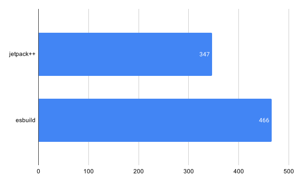
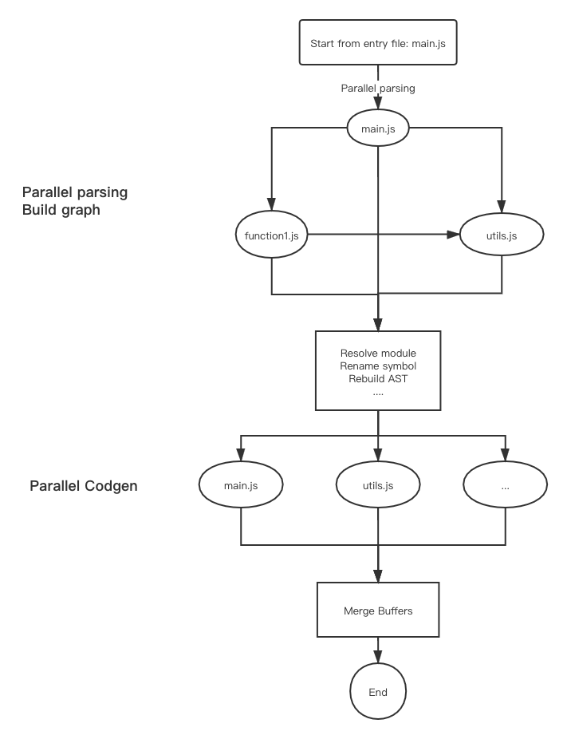

# Jetpack.js

[English Version](./README.md)

`jetpack.js` 是一个超级快的 ECMAScript 打包和压缩工具。

`jetpack.js` 采用模块化的设计，各部分组件都分离开，parser 可以单独使用

- [特性](#特性)
    - [Parser](#parser)
    - [Bundler](#bundler)
- [安装](#Installation)
- [使用](#usage)
- [单独使用 Parser](#单独使用-Parser)
- [性能](#performance)
- [架构](#architecture)
- [平台](#platform)

# 特性

## Parser

- 可以独立运行，可以作为 Node.js 模块
- 使用 C++ 实现，拥有极佳性能
- 完整支持 ECMAScript 2017([ECMA-262 8th Edition](http://www.ecma-international.org/publications/standards/Ecma-262.htm))
- 支持输出 JSON [语法树](https://github.com/estree/estree/blob/master/es5.md) format as standardized by [ESTree project](https://github.com/estree/estree)
- 支持 [JSX](https://facebook.github.io/jsx/)， 一种 [React](https://facebook.github.io/react/) 的语法
- 支持语法节点信息
- 友好的错误提示

## Bundler

- 模块解析
- 打包成一个文件
- Scope hoisting
- 常量折叠
- 压缩代码
- Sourcemap 生成

# 安装

```
npm install -g jetpackpp
```

Or

```
yarn global add jetpackpp
```

# 使用

Use command line to bundle a js module.
```shell script
jetpack main.js --out bundle.js
```

Help command:

```shell script
$ jetpackpp --help

Jetpack command line
Usage:
  Jetpack [OPTION...] positional parameters

      --tolerant            tolerant parsing error
      --jsx                 support jsx syntax
      --library             bundle as library, do not bundle node_modules
      --help                produce help message
      --analyze-module arg  analyze a module and print result
      --no-trace            do not trace ref file when analyze module
      --minify              minify the code
      --out arg             output filename of bundle
      --sourcemap           generate sourcemaps
```

# 单独使用 Parser

jetpack.js 使用 CMake 进行构建，所以你可以很好地继承到你的项目

```cmake
add_subdirectory(esparser)
target_include_directories(${PROJECT_NAME} ./esparser/src)
target_link_libraries(${PROJECT_NAME} PUBLIC esparser)
```

# 性能

我做了和 [esbuild](https://github.com/evanw/esbuild) 相同的测试。

> My main benchmark approximates a large codebase by duplicating the three.js library 10 times and building a single bundle from scratch, without any caches. For this benchmark, esbuild is 10-100x faster than the other JavaScript bundlers I tested (Webpack, Rollup, Parcel, and FuseBox). The benchmark can be run with make bench-three.



The tests were done on a 6-core 2018 MacBook Pro with 16GB of RAM
(similar to esbuild).

# 架构



代码都有注释，可以读读代码。

# 平台

`jetpack.js` 支持常见的平台:

- macOS
- Windows 64bit
- Linux 64bit
